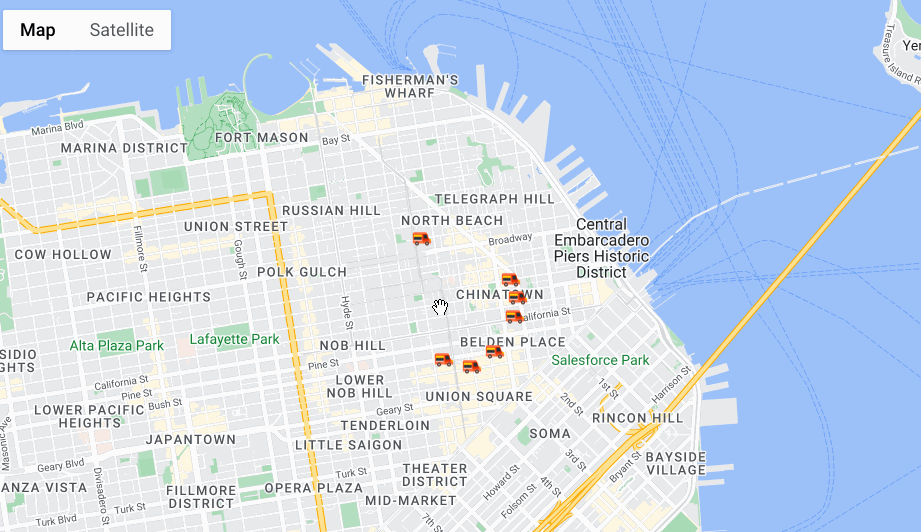

# Find a food truck closer to you in SFO downtown.

If you click on the map at your desired location, the app will find the nearest 7 food trucks for you. This simple version uses [geolib](https://github.com/manuelbieh/geolib) and [react-google-maps](https://tomchentw.github.io/react-google-maps/) library to achieve the desired outcome.

## Running Locally
* clone or download the code
* You will need a Google Maps API Key to run this app locally.
Create a new API key from the Google Cloud Platform console, then in  
`.env.local` file create an ENV var with the name `REACT_APP_FOODTRUCK_APP_GOOGLE_KEY`.
* npm install 
* npm run start

## Demo

